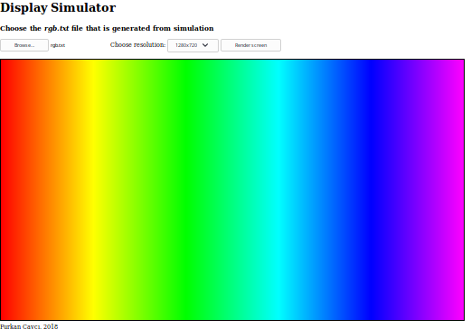

# vhdl-display-simulator

Screen Display Simulator written in VHDL and JS. Generates RGB pixel data file from VHDL simulation and displays the pixels on the browser. Expects 24-bit RGB data.

Example output for `pattern_generator.vhd` and `objectbuffer.vhd` are shown below.

 

## Procedure

### Using ISIM

1. create a project and import files in the `rtl` directory. 
2. add the testbench from `tb` directory and run the testbench until `vsync` is asserted.
3. `rgb.txt` data should be generated under project folder.
4. open `display.html` from `tools` directory in your browser, load the generated `rgb.txt` data, choose the resolution and hit `Render screen` button.

### Using GHDL

NOTE: Windows support is not added yet.

0. Install GHDL and add it to your path.
1. run `make` to check VHDL syntax in your code
2. run `make simulate` to create the RGB data. This runs the `tb_display.vhd` testbench for one full frame. It stores pixel color data per clock when in the active video area. Saves in a file called `rgb.txt`. This will take a couple seconds and will take around ~10MB space.
3. open `display.html` from `tools` directory in your browser, choose the resolution and hit `Render screen` button.

## Files

```
+- makefile                : GHDL simulation / RGB data generation
+- rtl/
| -- timing_generator.vhd  : timing generator
| -- pattern_generator.vhd : color spectrum pattern
| -- objectbuffer.vhd      : generates objects
+- tb/
| -- tb_display.vhd        : generates rgb values for one frame
+- tools/
|-- display.html           : HTML / JS code to display the generated rgb data
```
